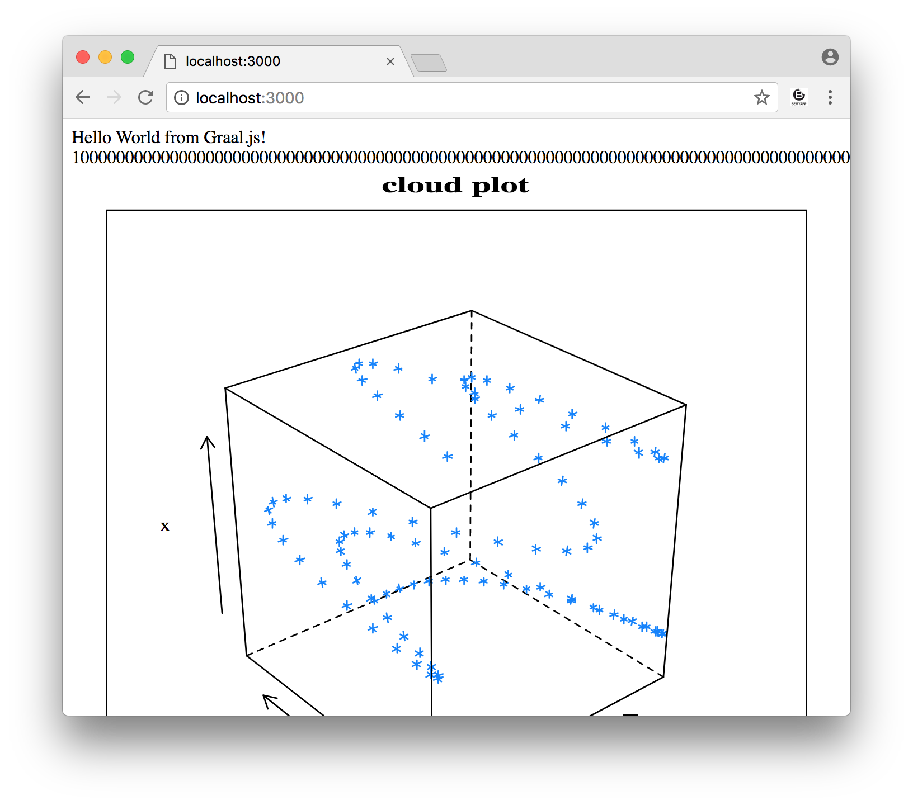

## Exercise 3: Polyglot - Combine JavaScript, Java, and R

GraalVM includes implementations of JavaScript, Ruby, R and Python on JVM. These are written using a new language implementation framework called
_**Truffle**_ that makes it possible to implement language interpreters that are
both simple and performant. 

When you write a language interpreter using
Truffle, Truffle will automatically use GraalVM on your behalf and provide you a JIT
compiler for your language. So GraalVM is not only a JIT compiler and
ahead-of-time native compiler for Java, but it can also provide a JIT compiler for
JavaScript, Ruby, R and Python through Truffle.

The languages in GraalVM aim to be drop-in replacements for your existing
languages. The core distribution of GraalVM includes the JVM, the GraalVM compiler, the LLVM runtime, and Node.js JavaScript runtime. Having downloaded and installed GraalVM, you can already run Java, Node.js, JavaScript, and LLVM-based applications.

GraalVM’s /bin directory is similar to that of a standard JDK, but includes a set of additional launchers:

* **js** a JavaScript launcher
* **node** a Node.js launcher
* **lli** a LLVM bitcode launcher
* **gu** the GraalVM Updater tool to install additional language runtimes and utilities


```bash
$ node -v
v12.18.4

$ js --version
GraalVM JavaScript (GraalVM EE Native 20.3.0)

$ lli --version
LLVM 10.0.0 (GraalVM EE Native 20.3.0)
```

For example, we can install a Node.js module:


`$ $GRAALVM_HOME/bin/npm install color`

```
...
+ color@3.1.1
added 6 packages from 6 contributors and audited 7 packages in 6.931s
```

We can write a simple program using this module to convert an RGB HTML color to
HSL (Hue, Saturation and Lightness).  Create a file called `color.js` and add the following code:


```javascript
var Color = require('color');

process.argv.slice(2).forEach(function (val) {
  console.log(Color(val).hsl().string());
});
```

Then we can run that in the usual way:


```
$ $GRAALVM_HOME/bin/node color.js '#42aaf4'
  hsl(204.89999999999998, 89%, 60.8%)
```

The languages in GraalVM work together and there's an API which allows you to run code
from one language in another enabling creation of polyglot programs.

The use case for polyglot programming often boils down to some feature missing in the language you're using to solve an issue. For example, JavaScript doesn't have a great solution for arbitrarily-large integers. Modules like `big-integer` exist but they tend to be inefficient as they store components of the number as JavaScript floating point numbers. Java's `BigInteger` class is more efficient for performing arbitrarily-large integer arithmetic.

JavaScript also doesn't include any built-in support for drawing graphs, where R includes excellent support. Let's use R's `svg` module to draw a 3D scatter plot of a trigonometric function.

In both cases we can use GraalVM's polyglot API, and we can just compose the results from these other languages into JavaScript.

First, let's install the `express` npm package:


`$ $GRAALVM_HOME/bin/npm install express`

Next, in your favorite IDE, create a new file called `polyglot.js`:


```js
const express = require('express')
const app = express()

const BigInteger = Java.type('java.math.BigInteger')

app.get('/', function (req, res) {
  var text = 'Hello World from Graal.js!<br> '

  // Using Java standard library classes
  text += BigInteger.valueOf(10).pow(100)
          .add(BigInteger.valueOf(43)).toString() + '<br>'

  // Using R interoperability to create graphs
  text += Polyglot.eval('R',
    `svg();
     require(lattice);
     x <- 1:100
     y <- sin(x/10)
     z <- cos(x^1.3/(runif(1)*5+10))
     print(cloud(x~y*z, main="cloud plot"))
     grDevices:::svg.off()
    `);

  res.send(text)
})

app.listen(3000, function () {
  console.log('Example app listening on port 3000!')
})
```

Now let's run the program:


`$ $GRAALVM_HOME/bin/node --jvm --polyglot polyglot.js`

Open http://localhost:3000/ in your browser to see the result.

*(NOTE: If your're using WSL2, you'll need to specify the IP address of your environment)*



That's another option we have available with GraalVM, the ability to run programs written in multiple languages and use modules from those languages together. We think of this as a
kind of commoditization of languages and modules - you can use whichever language you think is best for your use case and whichever library you want, no matter which language.


---
<a href="../ex04/">
    
</a>