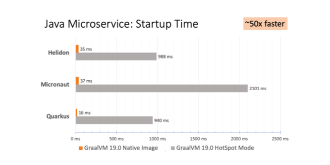
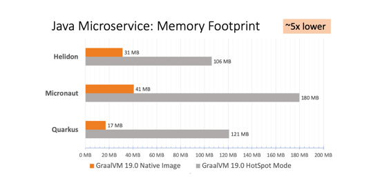

## Exercise 4: Microservices

Creating your first Micronaut GraalVM application


Next, we'll learn how to create a Hello World Micronaut GraalVM application. To get started, clone the git repository:


```bash
$ git clone https://github.com/micronaut-guides/micronaut-creating-first-graal-app.git
```

Change directory to the `complete` subdirectory within the cloned repo:

```bash
$ cd micronaut-creating-first-graal-app/complete
```

### Exercise 4.1: Deploying a native image inside a container

With this approach you only need to build the fat jar and then use Docker/Podman to build the native image.

Build the Graal fat jar:


```bash
$ ./gradlew assemble`
```

Modify the `Dockerfile` content, find `RUN native-image -cp build/libs/complete-*-all.jar` and change it to `RUN native-image -H:Class=example.micronaut.Application -cp build/libs/complete-*-all.jar`

Then build a container image, make certain the docker daemon service is running (or use `podman`).


```bash
$ sudo ./docker-build.sh
```

>>
>>If you are using Fedora 31 and above, you may have encountered an error when excuting the `docker-build.sh` script. Fedora 31+ is using CGroup v2 by default which is not compatible with Docker at this time.
>>On my Fedora 33 system, the script failed with message _**"OCI runtime create failed: this version of runc doesn't work on cgroups v2: unknown"**_
Here's the error output:
>>
>>```
>>$ sudo ./docker-build.sh
>>Sending build context to Docker daemon  65.13MB
>>Step 1/10 : FROM oracle/graalvm-ce:20.1.0-java8 as graalvm
>>---> fa8819f7526a
>>Step 2/10 : RUN gu install native-image
>>---> Running in 97c5d3a66402
>>OCI runtime create failed: this version of runc doesn't work on cgroups v2: unknown
>>```
>>
>>The workaround can be find [here](https://www.linuxuprising.com/2019/11/how-to-install-and-use-docker-on-fedora.html)
>>
>> On Fedora, run the following commands:
>>
>>
>>
>>```
>> $ sudo dnf install grubby
>> $ sudo grubby --update-kernel=ALL --args="systemd.unified_cgroup_hierarchy=0"
>> $ sudo reboot now  #reboot your machine
>>```
>>
>> Once your Fedora machine rebooted, try to execute `docker-build.sh` script again :
>>
>>
>>
>>```bash
>> $ sudo ./docker-build.sh
>>```
>>
>> You should be able to build a container image now.

The previous command will create the image `micronaut-graal-app:latest`.

Execute the native image container:


```bash
$ sudo docker run -p 3000:8080 --name=micronaut micronaut-graal-app
```

```
10:29:46.845 [main] INFO  io.micronaut.runtime.Micronaut - Startup completed in 12ms. Server Running: http://localhost:8080
```

We can see the application starts in only **12ms** (actual time will vary).


### A Note on Building on OSX

If you use a Mac, you will need to build your native images inside a Linux container if you want to deploy them inside Docker containers. If you stop and think about it for a second, that makes perfect sense, right?  You build on a Mac, you get a Mac executable.

You will, from time to time, forget this and then you will see the following error when you deploy your app into a docker container:

```text
standard_init_linux.go:211: exec user process caused "exec format error"
```

### Exercise 4.2: Sending a request to the application

From another terminal, you can run a few cURL requests to test the application:


```bash
$ time curl localhost:3000/conferences/random
```

```
{"name":"Greach"}
real    0m0.016s
user    0m0.005s
sys     0m0.004s
```

Finally, kill the docker container:


```bash
$ sudo docker kill micronaut
```






---
<a href="../ex05/">
    
</a>